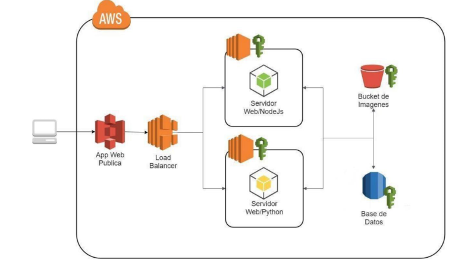
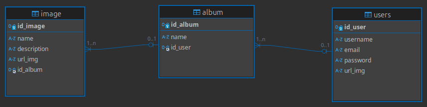
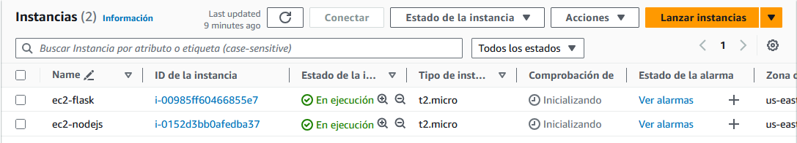
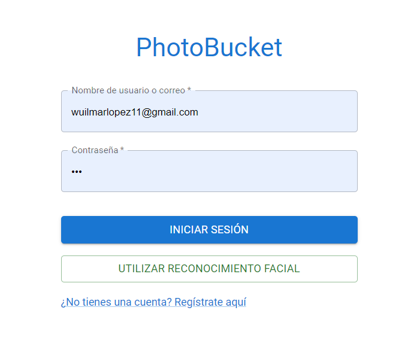
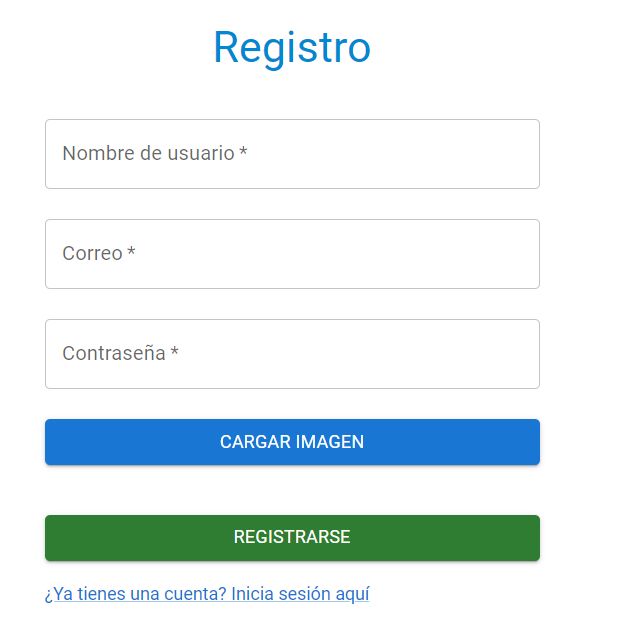
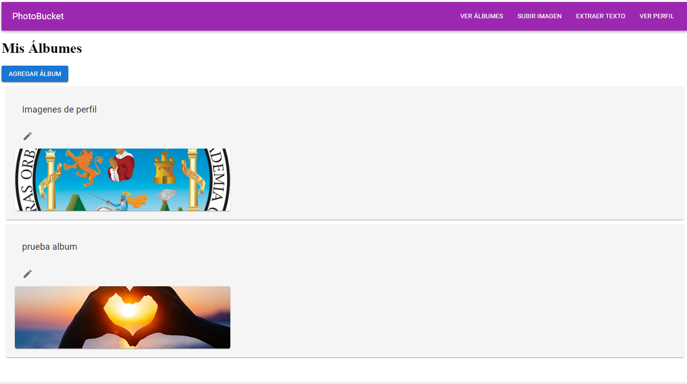
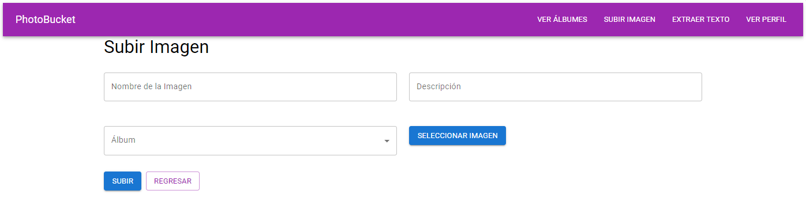
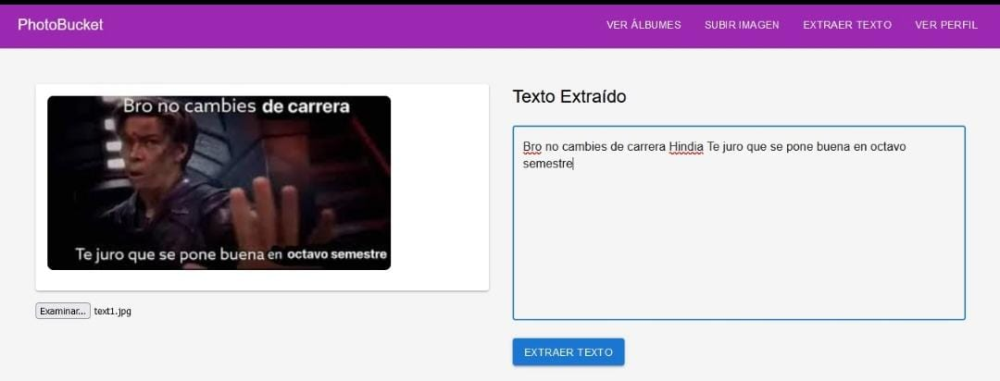
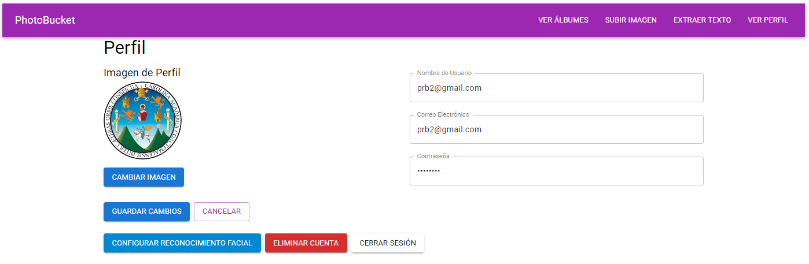

# Semi1-A-2S2024-Grupo7-Practica2


# Arquitectura de la aplicacion 

**La arquitectura** de la aplicación web alojada en AWS con los siguientes componentes clave:

- App Web Pública: Es el punto de entrada para los usuarios. La aplicación es pública y está disponible en la web.

- Load Balancer (Balanceador de Carga): Actúa como intermediario para distribuir el tráfico entre dos servidores web, asegurando que las solicitudes se distribuyan de manera eficiente y mejorando la disponibilidad y escalabilidad de la aplicación.

- Servidor Web/Node.js: Uno de los servidores web que ejecuta aplicaciones desarrolladas en Node.js. Este servidor podría manejar una parte del backend o lógica del servidor, sirviendo las peticiones entrantes.

- Servidor Web/Python: Otro servidor web que ejecuta aplicaciones desarrolladas en Python. Probablemente se encarga de otra parte de la lógica del backend o maneja diferentes endpoints de la aplicación.

- Bucket de Imágenes (S3): Un bucket de Amazon S3 utilizado para almacenar imágenes. S3 es un servicio de almacenamiento de objetos de AWS y, en este caso, almacena imágenes que podrían ser cargadas por los usuarios o generadas por la aplicación.

- Base de Datos: Un servicio de base de datos RDS que almacena los datos relacionados con la aplicación, como la información de los usuarios, los metadatos de las imágenes, etc.

- Claves de Seguridad (IAM): Todos los recursos (servidores web, bucket de imágenes y base de datos) están asegurados mediante el uso de claves y políticas de seguridad de IAM (Identity and Access Management), controlando qué recursos pueden ser accedidos y por quién.

**Flujo básico:**

- Los usuarios acceden a la App Web Pública, y el Load Balancer distribuye las peticiones entre los servidores de Node.js y Python.
- Los servidores se comunican con el Bucket de Imágenes en S3 para almacenar o recuperar imágenes.
- También se conectan a la Base de Datos para manejar información relacionada con los usuarios, imágenes u otros datos necesarios para el funcionamiento de la aplicación.

**Arquitectura**


**Base de Datos**



# Buckets S3
- [Bucket](https://practica2-semi1-a-2s2024-imagenes-g7.s3.amazonaws.com/ )

- [Fotos de Perfil](https://practica2-semi1-a-2s2024-imagenes-g7.s3.amazonaws.com/Fotos_Perfil)
- [Fotos Publicadas](https://practica2-semi1-a-2s2024-imagenes-g7.s3.amazonaws.com/Fotos_Publicadas)
- [Fotos Reconocimiento Facial](https://practica2-semi1-a-2s2024-imagenes-g7.s3.amazonaws.com/Fotos_Reconocimiento_Facial)


# Usuarios IAM y Permisos

- **adminEC2**
    - StartInstances - Iniciar instancias EC2.
    - StopInstances - Detener instancias EC2.
    - RebootInstances - Reiniciar instancias EC2.
    - RunInstances - Crear nuevas instancias EC2.
    - TerminateInstances - Eliminar instancias EC2.
    - ModifyInstanceAttribute - Modificar atributos de las instancias EC2.
    - DescribeKeyPairs - Ver pares de claves SSH.
    - CreateKeyPair - Crear pares de claves SSH.
    - DeleteKeyPair - Eliminar pares de claves SSH.
    - CreateSecurityGroup - Crear grupos de seguridad.
    - AuthorizeSecurityGroupIngress - Autorizar reglas de entrada en grupos de seguridad.
    - AuthorizeSecurityGroupEgress - Autorizar reglas de salida en grupos de seguridad.
    - AllocateAddress - Reservar direcciones IP elásticas.
    - AssociateAddress - Asociar direcciones IP elásticas.
    - ReleaseAddress - Liberar direcciones IP elásticas.
    - CreateVolume - Crear volúmenes de almacenamiento EBS.
    - DeleteVolume - Eliminar volúmenes EBS.
    - AttachVolume - Adjuntar volúmenes EBS a instancias EC2.
    - DetachVolume - Desconectar volúmenes EBS de instancias EC2.
    - GetMetricStatistics - Obtener estadísticas de métricas (CloudWatch).
    - DescribeLogStreams - Describir flujos de logs (CloudWatch Logs).
    - GetLogEvents - Ver eventos de logs (CloudWatch Logs).

- **adminBucketS3**
    - CreateBucket - Crear nuevos buckets S3.
    - DeleteBucket - Eliminar buckets S3.
    - ListBucket - Listar los objetos dentro de un bucket.
    - GetBucketLocation - Obtener la ubicación geográfica de un bucket.
    - PutBucketPolicy - Establecer o modificar políticas de acceso en un bucket.
    - GetBucketPolicy - Obtener la política de acceso de un bucket.
    - DeleteBucketPolicy - Eliminar la política de acceso de un bucket.
    - PutObject - Subir objetos a un bucket.
    - GetObject - Descargar objetos desde un bucket.
    - DeleteObject - Eliminar objetos de un bucket.
    - ListObjects - Listar los objetos almacenados en un bucket.
    - PutObjectAcl - Establecer permisos de acceso sobre objetos.
    - GetObjectAcl - Ver permisos de acceso sobre objetos.
    - PutBucketVersioning - Habilitar o modificar el versionado de objetos en un bucket.
    - GetBucketVersioning - Obtener la configuración de versionado de un bucket.
    - PutReplicationConfiguration - Establecer la configuración de replicación entre buckets.
    - GetReplicationConfiguration - Obtener la configuración de replicación de un bucket.
    - PutBucketLogging - Configurar logging de acceso en un bucket.
    - GetBucketLogging - Obtener la configuración de logging de un bucket.
    - PutBucketNotification - Configurar notificaciones basadas en eventos de S3.
    - GetBucketNotification - Obtener la configuración de notificaciones de un bucket.
    - PutBucketAcl - Establecer permisos de acceso en un bucket.
    - GetBucketAcl - Ver permisos de acceso de un bucket.
    - PutBucketEncryption - Habilitar o modificar el cifrado de objetos en un bucket.
    - GetBucketEncryption - Ver la configuración de cifrado de un bucket.
    - PutBucketTagging - Asignar etiquetas a un bucket.
    - GetBucketTagging - Obtener las etiquetas de un bucket.
    - DeleteBucketTagging - Eliminar las etiquetas de un bucket.
    - PutBucketLifecycle - Configurar políticas de ciclo de vida de objetos (expiración, archivado).
    - GetBucketLifecycle - Obtener la configuración del ciclo de vida de un bucket.
    - DeleteBucketLifecycle - Eliminar la configuración del ciclo de vida de un bucket.
    
- **Admin_BD**

    - CreateDBInstance - Crear instancias de bases de datos.
    - DeleteDBInstance - Eliminar instancias de bases de datos.
    - ModifyDBInstance - Modificar instancias de bases de datos.
    - DescribeDBInstances - Describir o listar instancias de bases de datos.
    - CreateDBSnapshot - Crear snapshots de bases de datos.
    - DeleteDBSnapshot - Eliminar snapshots de bases de datos.
    - DescribeDBSnapshots - Describir o listar snapshots de bases de datos.
    - CopyDBSnapshot - Copiar snapshots de bases de datos.
    - RestoreDBInstanceFromDBSnapshot - Restaurar una instancia de base de datos desde un snapshot.
    - CreateDBSecurityGroup - Crear grupos de seguridad de bases de datos.
    - DeleteDBSecurityGroup - Eliminar grupos de seguridad de bases de datos.
    - AuthorizeDBSecurityGroupIngress - Autorizar reglas de ingreso en grupos de seguridad.
    - RevokeDBSecurityGroupIngress - Revocar reglas de ingreso en grupos de seguridad.
    - ModifyDBSubnetGroup - Modificar grupos de subredes de bases de datos.
    - DescribeDBInstanceAutomatedBackups - Describir backups automatizados de bases de datos.
    - DescribeDBClusterEndpoints - Describir los endpoints de los clusters de bases de datos.
    - DescribeEvents - Obtener eventos relacionados con RDS.
    - DescribeDBParameters - Obtener parámetros de bases de datos.
    - DescribeDBClusterParameters - Describir parámetros de clusters.
    - StartDBInstanceAutomatedBackupsReplication - Iniciar la replicación de backups automatizados.
    - StopDBInstanceAutomatedBackupsReplication - Detener la replicación de backups automatizados.
    - CreateDBCluster - Crear clusters de bases de datos.
    - DeleteDBCluster - Eliminar clusters de bases de datos.
    - ModifyDBCluster - Modificar clusters de bases de datos.
    - RestoreDBClusterFromSnapshot - Restaurar un cluster de base de datos desde un snapshot.
    - StartDBInstanceAutomatedBackups - Iniciar backups automáticos de bases de datos.
    - RestoreDBInstanceToPointInTime - Restaurar una base de datos a un punto específico en el tiempo.
    - AddRoleToDBCluster - Asignar roles a un cluster de base de datos.
    - RemoveRoleFromDBCluster - Eliminar roles de un cluster de base de datos.
    - DescribeDBSecurityGroups - Describir los grupos de seguridad de bases de datos.
    - ModifyDBInstance - Modificar configuraciones de seguridad y cifrado en las instancias.
    - DescribeDBLogFiles - Describir los archivos de logs de bases de datos.
    - DownloadDBLogFilePortion - Descargar secciones de archivos de logs de bases de datos.


- **user-rekognition**
    - DetectLabels - Detectar etiquetas en imágenes.
    - DetectFaces - Detectar rostros en imágenes.
    - CompareFaces - Comparar rostros entre imágenes.
    - RecognizeCelebrities - Reconocer celebridades en imágenes.
    - DetectModerationLabels - Detectar contenido inapropiado en imágenes.
    - DetectText - Detectar texto en imágenes.
    - DetectCustomLabels - Detectar etiquetas personalizadas en imágenes usando un modelo entrenado.
    - StartLabelDetection - Iniciar la detección de etiquetas en videos.
    - GetLabelDetection - Obtener resultados de la detección de etiquetas en videos.
    - StartFaceDetection - Iniciar la detección de rostros en videos.
    - GetFaceDetection - Obtener resultados de la detección de rostros en videos.
    - StartCelebrityRecognition - Iniciar el reconocimiento de celebridades en videos.
    - GetCelebrityRecognition - Obtener resultados del reconocimiento de celebridades en videos.
    - StartContentModeration - Iniciar la moderación de contenido en videos.
    - GetContentModeration - Obtener resultados de la moderación de contenido en videos.
    - StartTextDetection - Iniciar la detección de texto en videos.
    - GetTextDetection - Obtener resultados de la detección de texto en videos.
    - CreateCollection - Crear colecciones de rostros.
    - DeleteCollection - Eliminar colecciones de rostros.
    - ListCollections - Listar colecciones de rostros.
    - IndexFaces - Indexar rostros en una colección.
    - DeleteFaces - Eliminar rostros de una colección.
    - SearchFaces - Buscar rostros en una colección usando un ID de rostro.
    - SearchFacesByImage - Buscar rostros en una colección usando una imagen.
    - CreateProject - Crear un proyecto de modelos personalizados.
    - DeleteProject - Eliminar un proyecto de modelos personalizados.
    - DescribeProject - Describir un proyecto de modelos personalizados.
    - CreateProjectVersion - Crear una nueva versión de un modelo personalizado.
    - DescribeProjectVersions - Describir las versiones de un modelo personalizado.
    - StartProjectVersion - Iniciar la ejecución de una versión de modelo personalizado.
    - StopProjectVersion - Detener la ejecución de una versión de modelo personalizado.
    - DeleteProjectVersion - Eliminar una versión de modelo personalizado.
    - ListFaces - Listar rostros en una colección.
    - GetFaceSearch - Obtener resultados de búsqueda de rostros en videos.
    - TagResource - Asignar etiquetas a recursos de Rekognition.
    - UntagResource - Eliminar etiquetas de recursos de Rekognition.
    - ListTagsForResource - Listar las etiquetas de recursos de Rekognition.

# Maquinas Virtuales  EC2 levantadas


# Funcionamiento

**login:** Inicio de sesion 


**registro:** Registro de usuarios  


**Album:** Albumes de imagenes de usuarios  


**Imagen:** Carga y creacion de imagenes


**Imagen:** Extraccion de Texto


**Cuenta:** Datos de usuario



### Endpoint Login

 >POST: http://localhost:5000/login_user
 >POST: http://localhost:5000/login_facial

 **REQUEST**

```json
// para  usuario y correo
{
    "email_or_username":"user1 || user1@gmail.com",
    "password":"passuser1",
}
// para  reconocimiento facial
{
    "photoImage":"objeto Foto"
}
```

**RESPONSE**

```json
// exito
{
"id_user":"1"  
}
// error
{
"error":"Error al logearse verificar datos"  
}


```

### Endpoint Usuario

> POST: http://localhost:5000/create_user

**REQUEST**

```json
{
    "username":"user1",
    "password":"passuser1",
    "email":"user@gmail.com",
    "url_img":"objetoImage"
}

```

**RESPONSE**

```json
// exito
{
"message":"Usuario creado con exito"  
}

// error
{
"error":"Usuario al crear el usuario"  
}

```

> POST: http://localhost:5000/get_user

**REQUEST**

```json
// Se manda el id del usuario
{
    "id_user":"1"
}

```

**RESPONSE**

```json
// Exito en los datos del usuario
{
    "id_user":1,
    "username":"user1",
    "password":"passuser1",
    "email":"user@gmail.com",
    "url_img":"http://s3.imagen1.png"
}

// error
{
"error":"Error, usuario no existe"  
}

```

> UPDATE: http://localhost:5000/update_user

**REQUEST**

```json
// data
{
    "id_user":1,
    "username":"user1",
    "email":"user@gmail.com",
    "url_img":"objetoImage",
    "password":"passuser1",
  
}

```

**RESPONSE**

```json
// Exito
{
    "id_user":1,
    "username":"user1",
    "email":"user@gmail.com",
    "url_img":"http://s3.imagen.png",
    "password":"passuser1"
}

// error
{
    "error":"Error, al actualizar datos de usuario"  
}

```

> DELETE: http://localhost:5000/delete_user

**REQUEST**

```json
// data
{
   "id_user":1,
   "password":"pass"
  
}

```

**RESPONSE**

```json
// Exito
{
    "message":"Usuario elimado exitosamente!!"
}

// error
{
"error":"Error, al eliminar usuario"  
}

```

## Endpoint Reconocimiento Facial

> POST: http://localhost:5000/create_user_facial

**REQUEST**

```json
{
    "name":"name",
    "url_img":"objetoImage",
    "id_album": 1
}

```

**RESPONSE**

```json
// exito
{
    "id_image":1,
    "url_image":"http://s3.imagen_facial.png",
    "id_album":1  
}

// error
{
"error":"Error al  crear reconocimiento facial"  
}

```

> POST: http://localhost:5000/get_user_facial

**REQUEST**

```json
// Se manda el id del reconocimiento facial
{
    "id_image":"1"
}

```

**RESPONSE**

```json
// Exito
{
    "id_image":1,
    "name":"nombre foto",
    "url_img":"http://s3.imagen1.png",
    "id_album":1
}

// error
{
"error":"Error, no existe este reconocimiento facial"  
}

```

> UPDATE: http://localhost:5000/update_user_facial

**REQUEST**

```json
// data
{
    "id_image":1,
    "url_image":"objetoImage",
    "id_album":1,
    "id_user":1,
    "password":"passuser1"
}

```

**RESPONSE**

```json
// Exito
{
    "id_image":1,
    "url_image":"http://s3.Image.png",
    "id_user":1
  
}

// error
{
"error":"Error, al actualizar datos de reconocimiento facial"  
}

```

> DELETE: http://localhost:5000/delete_user_facial

**REQUEST**

```json
// data
{
   "id_image":1,
   "id_album":1
}

```

**RESPONSE**

```json
// Exito
{
    "message":"Reconocimiento facial desactivado o eliminado exitosamente!!"
}

// error
{
"error":"Error, al eliminar reconocimiento facial"  
}

```

## Endpoint Crear Album

> POST: http://localhost:5000/create_album

**REQUEST**

```json
{
    "name":"name",
    "id_user": 1
}

```

**RESPONSE**

```json
// exito
{
    "id_album":1,
    "name":"nombre"  
}

// error
{
"error":"Error al  crear album"  
}

```

> POST: http://localhost:5000/get_album

**REQUEST**

```json
// Se manda el id del reconocimiento facial
{
    "id_album":"1"
}

```

**RESPONSE**

```json
// Exito
{
    "id_album":1,
    "name":"nombre album",
  
}

// error
{
"error":"Error, al obtener album"  
}

```

> POST: http://localhost:5000/get_all_album

**REQUEST**

```json
// Se manda el id del reconocimiento facial
{
    "id_user":"1"
}

```

**RESPONSE**

```json
// Exito
{
    [
        {
            "id_album":1,
            "name":"nombre album"
        },
        {
            "id_album":2,
            "name":"nombre album"
        },
    ]  
}

// error
{
    "error":"Error, al obtener las listas de albumes"  
}

```

> UPDATE: http://localhost:5000/update_album

**REQUEST**

```json
// data
{
    "id_album":1,
    "name":"nuevo nombre album"
}

```

**RESPONSE**

```json
// Exito
{
    "id_album":1,
    "name":"nuevo nombre"
}

// error
{
"error":"Error, al actualizar nombre del album"  
}

```

> DELETE: http://localhost:5000/delete_album

**REQUEST**

```json
// data
{
   "id_album":1
}

```

**RESPONSE**

```json
// Exito
{
    "message":"Album eliminado correctamente!!"
}

// error
{
"error":"Error, al eliminar album"  
}

```

## Endpoint Imagenes

> POST: http://localhost:5000/create_imagen

**REQUEST**

```json
{
    "name":"nombre imagen",
    "description": "descripcion",
    "url_img":"objetoImage",
    "id_album": 1
}

```

**RESPONSE**

```json
// exito
{
    "id_image":1,
    "name":"nombre imagen",
    "description": "descripcion",
    "url_img":"http://s3.imange.png",
    "id_album": 1,   
}

// error
{
"error":"Error al  crear imagen en album"  
}

```

> POST: http://localhost:5000/get_imagen

**REQUEST**

```json
// Se manda el id del reconocimiento facial
{
    "id_image":1
}

```

**RESPONSE**

```json
// Exito
{
    "id_image":1,
    "name":"nombre album",
    "description":"descripcion",
    "url_img":"http://s3.imagen"
  
}

// error
{
"error":"Error, al obtener imagen"  
}

```

> POST: http://localhost:5000/get_all_imagen_album

**REQUEST**

```json
// Se manda el id del reconocimiento facial
{
    "id_album":"1"
}

```

**RESPONSE**

```json
// Exito
{
    [
        {
            "id_image":1,
            "name":"nombre album",
            "description":"descripcion image",
            "url_img":"http://s3.Imagen.png"
        },
        {
            "id_image":2,
            "name":"nombre album",
            "description":"descripcion image",
            "url_img":"http://s3.Imagen2.png"
        },
    ]  
}

// error
{
    "error":"Error, al obtener las imagenes del album"  
}

```

> UPDATE: http://localhost:5000/update_imagen

**REQUEST**

```json
// data
{
    "id_image":1,
    "name":"nuevo nombre imagen",
    "description":"nueva descripcion imagen"
}

```

**RESPONSE**

```json
// Exito
{
    "id_image":1,
    "name":"nuevo nombre imagen",
    "description":"nueva descripcion imagen",
    "url_img":"http:s3.NuemaImage.png"
}

// error
{
"error":"Error, al actualizar datos de imagen"  
}

```

> DELETE: http://localhost:5000/delete_imagen

**REQUEST**

```json
// data
{
   "id_image":1
}

```

**RESPONSE**

```json
// Exito
{
    "message":"Imagen eliminado correctamente!!"
}

// error
{
"error":"Error, al eliminar imagen"  
}

```
## Enpoint Rekognition

> POST: http://localhost:5000/extract_text

**REQUEST**

```json
// data
{
   "image":"Objeto Image"
}

```

**RESPONSE**

```json
// Exito
{
    "text":"La informacion de la imagen"
}
    
// error
{
"error":"Error, al extraer texto en imagen"  
}
```


> POST: http://localhost:5000/extract_label

**REQUEST**

```json
// data
{
   "url_img":"url imagen"
}

```

**RESPONSE**

```json
// Exito
[
    "Book",
    "Comics",
    "Publication",
    "Animal",
    "Bird"
]

// error
{
"error":"Error, al extraer etiquetas en imagen"  
}

```

> POST: http://localhost:5000/upload_rekog

**REQUEST**

```json
// data
{
    "id_user": id,
    "password":pass,
    "image":"formdata img"
}

```

**RESPONSE**

```json
{"message": "Reconocimiento facial creado"}
```

> POST: http://localhost:5000/validate_rek

**REQUEST**

```json
// data
{
    "image":"object"
}


```
## Translate 

> POST: http://localhost:5000/translate_text

**REQUEST**

```json
// data
{
   "description":"Este es un bello pais xD"
}

```

**RESPONSE**

```json
// Exito
{
    "ingles": "This is a beautiful country xD",
    "frances": "C'est un pays magnifique xD",
    "portugues": "Este é um lindo país xD"
}

// error
{
"error":"Mensaje de error"  
}

```